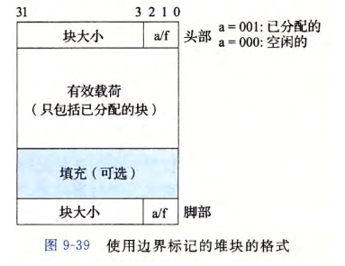

**详细的解析查看每一个文件下面的step.md文件**

# datalab


自己的代码必须遵循一定的风格

```c
  int Funct(arg1, arg2, ...) {
      /* brief description of how your implementation works */
      int var1 = Expr1;
      ...
      int varM = ExprM;

      varJ = ExprJ;
      ...
      varN = ExprN;
      return ExprR;
  }
```

1. 每一个表达式中整数常量被限制在0到255(0xff)之内
2. 不允许使用全局变量
3. 一元运算符使用 ~ !
4. 二元运算符使用 & ^ | + << >>

禁止使用

1. 控制结构，例如if, do, while, for, switch
2. 定义或者使用任何宏
3. 定义或者调用任何函数
4. 使用其余的运算符例如：&&, ||, -
5. 使用类型转换
6. 只能够使用int类型


收获：根据一定的限制要求，例如运算符使用的限制，整数常量的限制，来完成一些任务，例如

1. 判断数字所有的奇数位都应该是1返回1,否则返回0.(获取偶数位全为1，0x55<<8+0x55..  |  x)应该全是1，然后对答案进行区反应该为0,在！取非  

2. 判断x是否在一定范围 `[0x30,0x39]` 之内，主要的思想是找到公共相同的部分进行约束

3. 实现 x ? y : z   

   ```c
   int conditional(int x, int y, int z) {
       //判断x是否是0，x是0返回1.
       int is0 = !x;  //对x进行非操作，如果x==0返回1，如果x！=0返回1
       is0 = is0 + (~0x00);   //如果x是0，is0==0,如果x是1,is0=0xffff...
       return (is0 & y) | ((~is0) & z);
   }
   ```

   还有一些浮点数的运算，明白了信息是由，在底层上数字构成的，但是在高层上会根据数字的类型进行相应的解析成对应的信息。


# bomb

详细过程参考 bomb/step.md


收获：能够使用gdb进行调试可执行文件，通过查找程序调用explode_bomb的位置，来进行避免进入explode_bomb函数发生爆炸的行为。通过静态的阅读汇编代码结合动态的执行gdb执行指令，来理解汇编代码的功能，能够阅读理解相关的x86的汇编代码，使用gdb进行调试。

# attack

理解了从最初的栈溢出的危害，比如在进行调用下一个函数的时候，我们会将当前函数的下一条指令的地址值进行添加到栈中(也就是call指令的作用)。在下一个函数如果存在输入的话，输入的字符串不断地向上进行覆盖，当我们输入的长度大于该栈预先分配的大小的时候就会覆盖原来的函数的下一条指令。如果发生栈溢出当执行return语句的时候，会跳转到错误的位置。

**理解重点：注意我们的注入的代码的核心思想是：首先是根据当前的getbuf函数ret之后执行我们输入的地址到rip寄存器中，这个时候rip执行一条命令然后执行一条ret，也就是说我们截取的代码必须是ret之前的一条指令，然后只有这样才能不断的获取栈上面的地址值不断的执行地址内存中对应的命令**

**不能把可执行的代码放在栈中了。可以利用程序中原有代码的字节码。**

- 栈随机化：使得程序每次运行时栈的地址都不相同，我们无法得知我们注入的攻击代码的地址，也无法在攻击代码中硬编码栈中的地址。
- 标记内存中的栈段为不可执行：这意味着注入在栈中的代码无法被程序执行。

将栈溢出的地方，放上我们期望的执行的代码的一小段地址，然后不断的return进行返回不断的获取我们期望的执行的地址。


收获了进一步明白了ret call push pop指令对寄存器和栈的操作，明白了程序中栈的模型样子。同时也应该注意不要编写缓冲区溢出的代码。

# archlab

环境配置比较困难

目前完成了前两个部分

# cache


主要是理解缓存的作用，编写缓存友好的代码

其中64*64的矩阵miss还有待优化

# shelab 

主要的任务就是创建一个shell进程，在该进程中执行一些子进程的操作，该子进程可以运行在后台也可以运行在前端，可以父进程可以调用函数捕捉子进程终止的信号，以及处理信号`<C-c> <C-z>`

**接下来说说自己对与信号理论上的理解，首先什么时候执行信号处理：先说每个进程都会占据cpu的一部分时间，然后不断的在cpu上进行切换，每当一个程序上cpu这个时候就会检查下当前的进程是否接收到某些信号，然后执行信号处理函数，如果没有接收到信号那么继续下面的执行。现在我们讨论的是接收的信号之后是什么情况。**

详细的过程查看step.md

# malloclab




开始块是一个没有有效载荷的只有头部和脚部的8个字节的块，隐式链表的head指向该头部和脚步之间的部分，然后在初始化的时候后面是紧跟着一大块(没有分配)，然后最后的结尾标志是块大小是0已经分配出去的特殊情况(注意即使是new(0)，也应该会有头部和脚部共8个字节)。将中间的一大块按照一定的规则不断的分配回收，规则包括设置头部脚部，字节对齐操作，还要注意回收的合并操作。

理解了相应的mem、mm模型。

完成了内存分配算法的首次适应算法。


# proxylab

但是在代理上面可能是测试url请求路径不一样还是什么情况，按照测试路径换成自己的就可以实现相关的cache。

我在本地开启代理端口是9090，服务器端口是8080，先是连接9090端口请求服务器资源/home.html这个时候代理会先查找本地的cache中查看，当前是否有url = http://localhost:8080/home.html的content如果有那么直接返回给客户端，如果没有代理服务器9090会向服务器8080请求资源home.html，将服务器给代理的content在本地保存下来并且也返回给客户端，当客户端下次访问的时候直接就会在cache找到相关的内容直接返回，不会再请求服务器8080。
