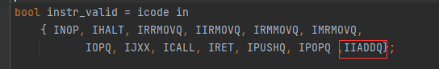
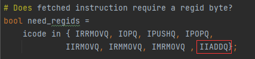
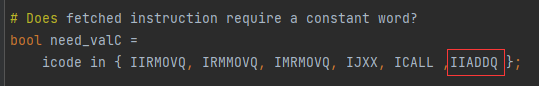
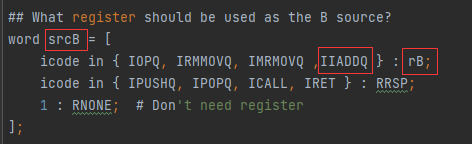
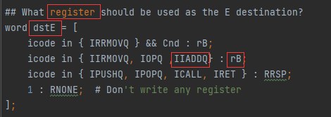
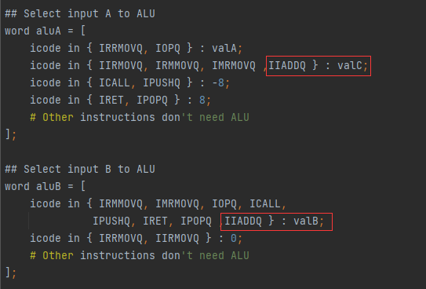

# 1

```c
long sum_list(list_ptr ls) {
    long val = 0;
    while (ls) {
        val += ls->val;
        ls = ls->next;
    }
    return val;
}
```

根据上面的思想写出下面的汇编代码

```
# Execution begins at address 0
	.pos 0
	irmovq stack ,%rsp   #set up stack pointer
	call main            #exe main program

# Sample linked list
    .align 8
ele1:
    .quad 0x00a
    .quad ele2
ele2:
    .quad 0x0b0
    .quad ele3
ele3:
    .quad 0xc00
    .quad 0

main:
	irmovq ele1,%rdi    # 将链表的首地址放到rdi寄存器中
	call sum_list
	ret

sum_list:
    irmovq $0,%rax
loop:
	andq %rdi,%rdi    # 查看rdi是否是0
	je last           # ==0跳转到last
	mrmovq (%rdi),%r10   # 将链表中的值放到r10寄存器中
	addq %r10,%rax       # 将返回值rax加上r10
	mrmovq 8(%rdi),%rdi
	jmp loop	
last:
	ret

#Stack starts here and grows to lower addresses
          .pos 0x100
stack:
```


```c
long rsum_list(list_ptr ls) {
    if (!ls)
        return 0;
    else {
        long val = ls->val;
        long rest = rsum_list(ls->next);
        return val + rest;
    }
}
```

写出递归代码：

```
# Execution begins at address 0
	.pos 0
	irmovq stack ,%rsp   #set up stack pointer
	call main            #exe main program

# Sample linked list
    .align 8
ele1:
    .quad 0x00a
    .quad ele2
ele2:
    .quad 0x0b0
    .quad ele3
ele3:
    .quad 0xc00
    .quad 0

main:
	irmovq ele1,%rdi    # 将链表的首地址放到rdi寄存器中
	call rsum_list
	ret

rsum_list:
    irmovq $0,%rax
	andq %rdi,%rdi       # 查看rdi是否是0
	je last              # ==0跳转到last
	mrmovq (%rdi),%r10   # 将链表中的值放到r10寄存器中
	pushq %r10           # 将当前的值保存到栈中，不然下次递归会覆盖
	mrmovq 8(%rdi),%rdi  
	call rsum_list
	popq %r10
	addq %r10,%rax
last:
	ret

#Stack starts here and grows to lower addresses
          .pos 0x100
stack:
```

```c
#include <stdio.h>
/* copy_block - Copy src to dest and return xor checksum of src */
long copy_block(long *src, long *dest, long len) {
    long result = 0;
    while (len > 0) {
        long val = *src++;
        *dest++ = val;
        result ^= val;
        len--;
    }
    return result;
}

int main() {
    long src[3] = {10,11,12};
    long dest[3] = {20,21,22};
    copy_block(src,dest,3);
    for (int i = 0; i < 3; ++i) {
        printf("%d\n",dest[i]);
    }
    return 0;
}
/*
输出：先测试下效果，C基本语法还不是很清楚*和++混合指针有点懵
10
11
12   
*/
```

```
#Excution begins at address 0
   .pos 0
   irmovq stack, %rsp
   call main
   halt
.align 8
#Source block
src:
   .quad 0x00a
   .quad 0x0b0
   .quad 0xc00
# Destination block
dest:
   .quad 0x111
   .quad 0x222
   .quad 0x333

main:
    irmovq src,%rdi     # 源地址
    irmovq dest,%rsi    # 目标地址
    irmovq $3,%rdx       # 第三个参数
    call copy_block
    ret

copy_block:
    irmovq $0,%rax      # 返回值清0
    irmovq $1,%r10      # 将1放到r10中
    irmovq $8,%r11
loop:
    andq %rdx,%rdx       # 查看rdx的值是否是0，如果是0退出
    je last
    mrmovq (%rdi),%r9     # 将第一个地址值放到寄存器中
    addq %r11,%rdi        # 源地址自增
    rmmovq %r9,(%rsi)     # 将取出来的值放到rsi目的内存中
    addq %r11,%rsi        # 目标地址自增
    xorq %r9,%rax         # result ^= val
    subq %r10,%rdx
    jmp loop
last:
    ret

# Stack starts here and grows to lower addresses
   .pos 0x300
stack:
```

```
$ ./yas ans/copy.ys
$ ./yis ans/copy.yo
Stopped in 41 steps at PC = 0x13.  Status 'HLT', CC Z=1 S=0 O=0
Changes to registers:
%rax:   0x0000000000000000      0x0000000000000cba
%rsp:   0x0000000000000000      0x0000000000000300
%rsi:   0x0000000000000000      0x0000000000000048
%rdi:   0x0000000000000000      0x0000000000000030
%r9:    0x0000000000000000      0x0000000000000c00
%r10:   0x0000000000000000      0x0000000000000001
%r11:   0x0000000000000000      0x0000000000000008

Changes to memory:
0x0030: 0x0000000000000111      0x000000000000000a
0x0038: 0x0000000000000222      0x00000000000000b0
0x0040: 0x0000000000000333      0x0000000000000c00
0x02f0: 0x0000000000000000      0x000000000000006f
0x02f8: 0x0000000000000000      0x0000000000000013
```


# 2

参考：https://chowdera.com/2022/03/202203132232068338.html

这一题主要是分析一下iaddq的顺序实现

根据图1-18我们可以发现写一个类似的iaddq的指令

| 阶段   | iaddq V,rB                                                   |
| ------ | ------------------------------------------------------------ |
| 取指   | icode：ifun  =  M1[PC]    ；   rB = M1[PC+1]      ； valC = M8[PC+2]    ;   valP = PC+10 |
| 译码   | valB  = R[rB]                                                |
| 执行   | valE = valC + valB                                           |
| 访存   |                                                              |
| 写回   | R[rB] = valE                                                 |
| 更新PC | PC = valP                                                    |

然后就是修改文件seq-full.hcl文件将iaddq命令添加到对应的位置

- 首先判断指令是否合法，将iaddq命令添加进去



- 该指令是否需要寄存器的id

  

- 该指令是否需要常数



- 下面就是src来自哪里



- 然后就是dst



- 最后就是执行阶段，需要使用到valC和valB



总的来说就是将iaddq执行的情况，放到对应中。
