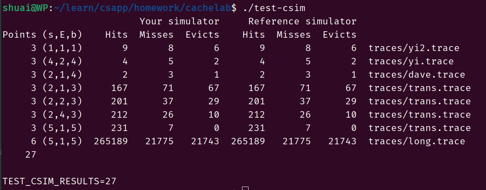
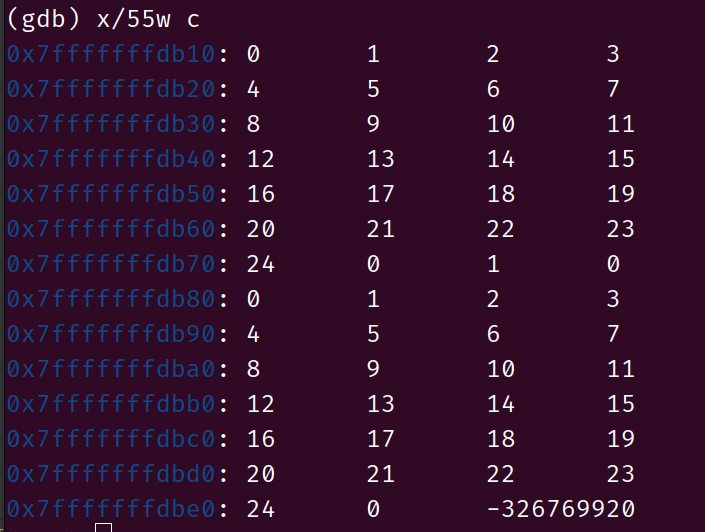
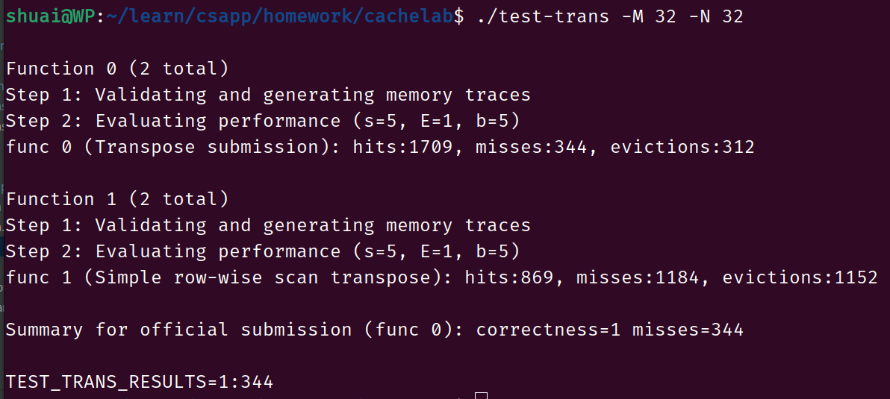
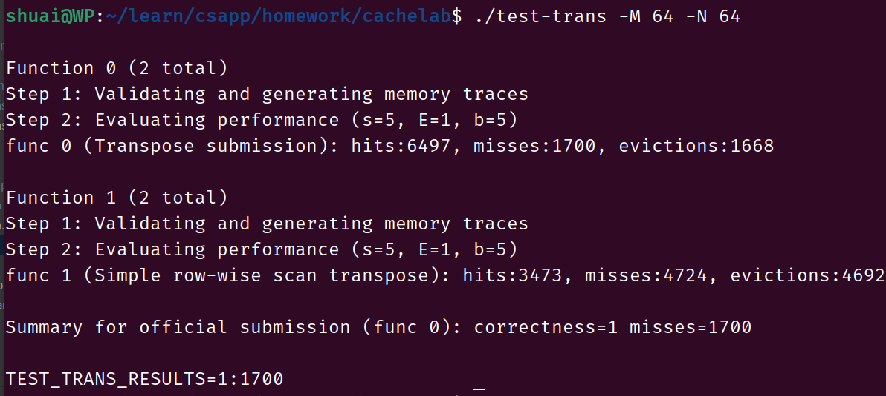
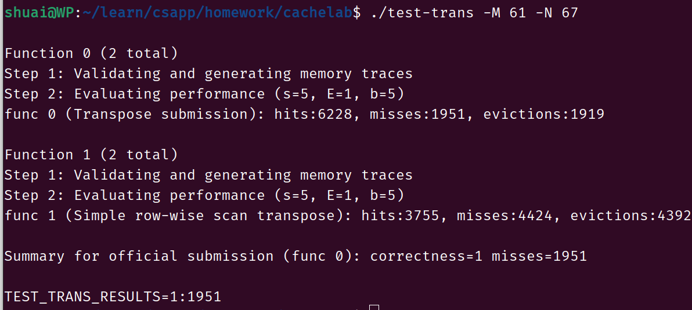
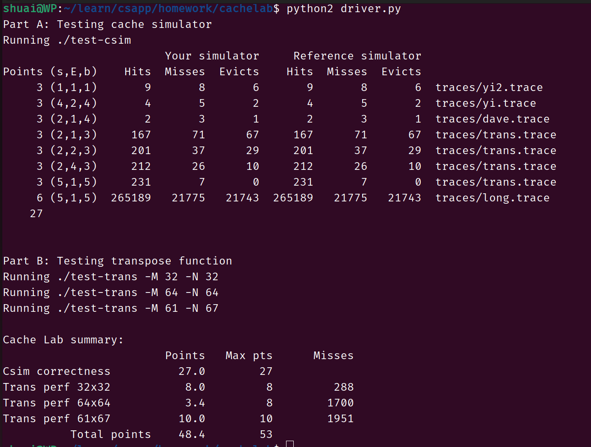

# partA

第一部分的模拟结果




# partB

记录下cachelab的第二部分的思路

```c
#include <stdio.h>

int main(){
    int a[5][5];
    int b[5][5];
    int num = 0;
    int *c = a;
    int *d = b;
    for (int i = 0; i < 5; ++i) {
        for (int j = 0; j < 5; ++j) {
            a[i][j] = num;
            b[i][j] = num;
            num++;
        }
    }
    return 0;
}
```

为了方便理解首先我们随便定义了两个数组，查看这两个数组在内存中的位置。



自定义了两个2维数组，发现这两个数组几乎是在内存的**相邻连续的位置处**，这样我们就知道了数组在内存中的存放是相邻的位置，使用缓存的时候更加清晰的了解了。

下面开始分析缓存大小和数组的每一行会放在缓存的什么地方(s = 5, E = 1, b = 5)，题目的要求是在32组，每个组有1个缓存行，每行的数据大小是32字节，由于题目中的矩阵的数据类型是int(每一个数占据4个字节)，我们可以知道，缓存的大小是32*8 = 256个int类型的数据，每一个缓存行只能够存放矩阵的8个数据。

首先我们先分析32*32的矩阵，下面的表格代表了当前的行和列存放在第几个缓存中，其中有32行，4列(每一列代表着8个数据)。

| 行列    | 0    | 8    | 16   | 24   |
| ------- | ---- | ---- | ---- | ---- |
| 0       | 0    | 1    | 2    | 3    |
| ....... |      |      |      |      |
| 7       | 28   | 29   | 30   | 31   |
| 8       | 0    | 1    | 2    | 3    |
| .....   |      |      |      |      |
| 15      | 28   | 29   | 30   | 31   |
| 16      | 0    | 1    | 2    | 3    |
| ....... |      |      |      |      |
| 23      | 28   | 29   | 30   | 31   |
| 24      | 0    | 1    | 2    | 3    |
| .....   |      |      |      |      |
| 31      | 28   | 29   | 30   | 31   |

由于B也是紧跟着A的，那么B的矩阵对应的cache组也和上面的一样。下面就是根据转置操作想办法避开相同的cache组。

首先是分块的思想，首先我们发现每经过8行缓存行的组就会重新开始，所以我们最多应该选取8行，那么开始考虑每一行应该选择多少个数据，尝试下选择8个数据试试。

```c
void transpose_submit(int M, int N, int A[N][M], int B[M][N]) {
    int a, b, i, j, temp;
    for (a = 0; a < 4; ++a) {      //行增加
        for (b = 0; b < 4; ++b) {  //列增加
            for (i = 0; i < 8; ++i) {
                for (j = 0; j < 8; ++j) {
                    temp = A[i + a * 8][j + b * 8];
                    B[j + b * 8][i + a * 8] = temp;
                }
            }
        }
    }
}
```

根据上面的代码以及上面的表格以及pdf上面的提示，我们可以发现现在最大的问题就是在对角线上的元素的miss情况，因为我们可以根据上面的表格发现情况，在对角线上的组是有冲突的。

```
[0,0]---[7,7]
[8,8]---[15,15]
[16,16]---[23,23]
[24,24]---[31,31]
这四个正方形矩阵对应的缓存行是一致的，思考怎么进行修改。
```

我们可以发现对于每一行的8个数，每一次取一个A然后就会取一次B(在取B的时候就会将A的情况下覆盖)，这个时候我们可以将一行的数据进行保存下来，这样的情况就是先取A，将这一行保存下来，然后在取B，将这一行进行保存下来，而不是取一次A，取一次B来回进行8次。(这是处在对角线情况下的优化)。

```c
//针对对角线进行了优化
void transpose_submit(int M, int N, int A[N][M], int B[M][N]) {
    int a, b, i;
    int k0, k1, k2, k3, k4, k5, k6, k7;
    for (a = 0; a < 4; ++a) {      //行增加
        for (b = 0; b < 4; ++b) {  //列增加
            for (i = 0; i < 8; ++i) {
                k0 = A[i + a * 8][b * 8];
                k1 = A[i + a * 8][1 + b * 8];
                k2 = A[i + a * 8][2 + b * 8];
                k3 = A[i + a * 8][3 + b * 8];
                k4 = A[i + a * 8][4 + b * 8];
                k5 = A[i + a * 8][5 + b * 8];
                k6 = A[i + a * 8][6 + b * 8];
                k7 = A[i + a * 8][7 + b * 8];
                B[b * 8][i + a * 8] = k0;
                B[1 + b * 8][i + a * 8] = k1;
                B[2 + b * 8][i + a * 8] = k2;
                B[3 + b * 8][i + a * 8] = k3;
                B[4 + b * 8][i + a * 8] = k4;
                B[5 + b * 8][i + a * 8] = k5;
                B[6 + b * 8][i + a * 8] = k6;
                B[7 + b * 8][i + a * 8] = k7;
            }
        }
    }
}
```




## 64 * 64有待优化

下面开始对64*64的矩阵进行分析

| 行/列    | 0    | 8    | 16   | 24   | 32   | 40   | 48   | 56   |
| -------- | ---- | ---- | ---- | ---- | ---- | ---- | ---- | ---- |
| 0        | 0    | 1    | 2    | 3    | 4    | 5    | 6    | 7    |
| .....    |      |      |      |      |      |      |      |      |
| 3        | 24   | 25   | 26   | 27   | 28   | 29   | 30   | 31   |
| 4        | 0    | 1    | 2    | 3    | 4    | 5    | 6    | 7    |
| ......   |      |      |      |      |      |      |      |      |
| 7        | 24   | 25   | 26   | 27   | 28   | 29   | 30   | 31   |
| .......  |      |      |      |      |      |      |      |      |
| 60       | 0    | 1    | 2    | 3    | 4    | 5    | 6    | 7    |
| ........ |      |      |      |      |      |      |      |      |
| 63       | 24   | 25   | 26   | 27   | 28   | 29   | 30   | 31   |

根据上面的分析可以知道对于64行的数据来说每4行就会重新cache组，所以在进行分块的时候不能在以8行进行分块，应该以4行进行分块。对于A来说行是4，那么对于B来说列应该也是4，所以矩阵分成4 * 4的情况（为什么不能分成4 * 8的情况，从矩阵块的角度上来看，每一个组里面刚好有8个元素，但是在进行赋值到矩阵B的时候我们会发现如果对于A的每一行有8个元素，那么就会对应B中的8行，之前分析过了每4行cache就会重新进行，所以对于B来说miss的次数就会大大增加）。

首先进行4*4的分块进行查看结果

```c
void transpose_submit(int M, int N, int A[N][M], int B[M][N]) {
    int a, b, i;
    int k0, k1, k2, k3;
    for (a = 0; a < 16; ++a) {      //行增加
        for (b = 0; b < 16; ++b) {  //列增加
            for (i = 0; i < 4; ++i) {
                k0 = A[i + a * 4][b * 4];
                k1 = A[i + a * 4][1 + b * 4];
                k2 = A[i + a * 4][2 + b * 4];
                k3 = A[i + a * 4][3 + b * 4];
                B[b * 4][i + a * 4] = k0;
                B[1 + b * 4][i + a * 4] = k1;
                B[2 + b * 4][i + a * 4] = k2;
                B[3 + b * 4][i + a * 4] = k3;
            }
        }
    }
}
```




最后就是61*67的矩阵

```c
void transpose_submit(int M, int N, int A[N][M], int B[M][N]) {
    int a, b, i;
    int temp;
    int step = 17;
    for (a = 0; a < N; a += step) {      //行增加
        for (b = 0; b < M; b += step) {  //列增加
            for (i = 0; i < step && i + a < N; ++i) {
                for (int j = 0; j < step && j + b < M; ++j) {
                    temp = A[a + i][b + j];
                    B[b + j][a + i] = temp;
                }
            }
        }
    }
}
```

经过不断的修改step也就是矩阵的大小，最后尝试使用17进行操作。

参考  https://chowdera.com/2022/02/202202190639544898.html




最后运行driver.py程序进行最终的测试

