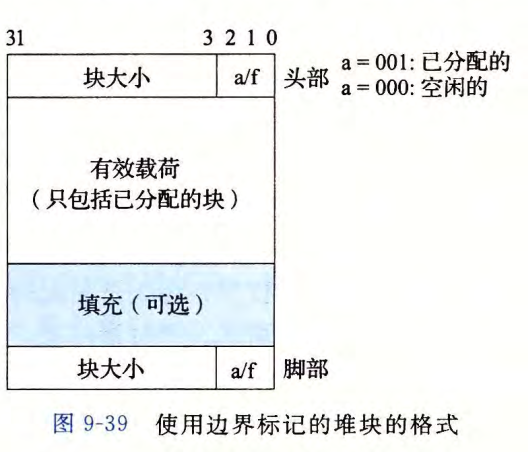
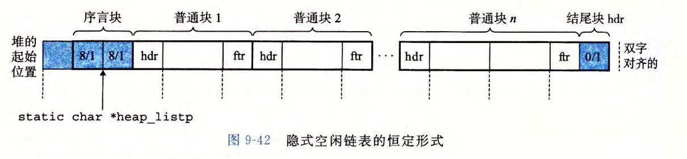
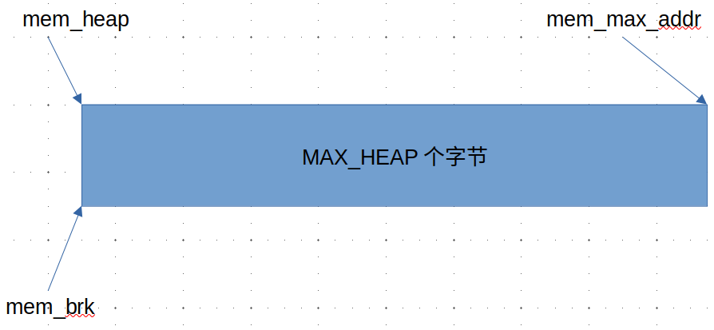
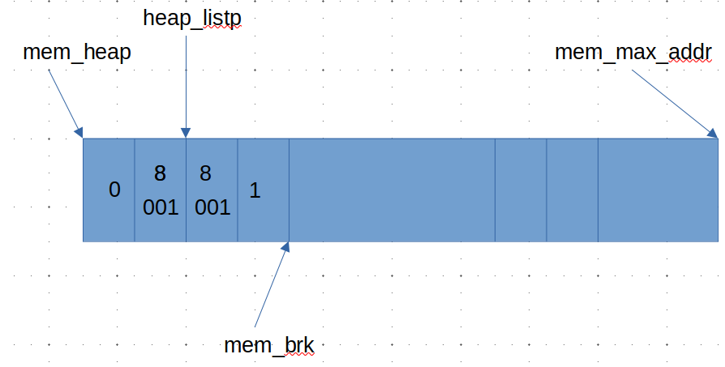
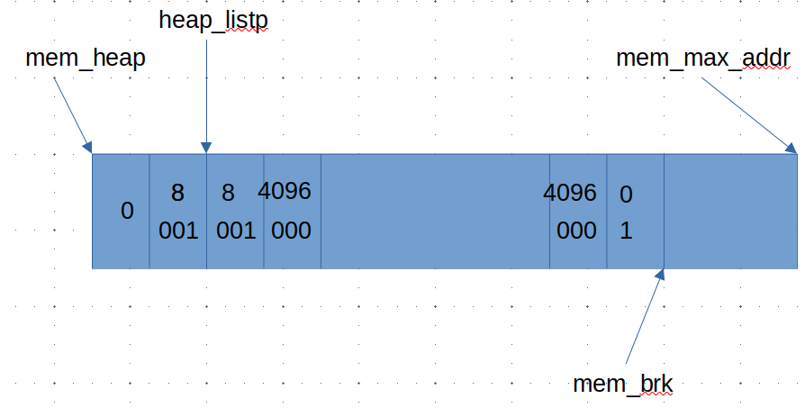
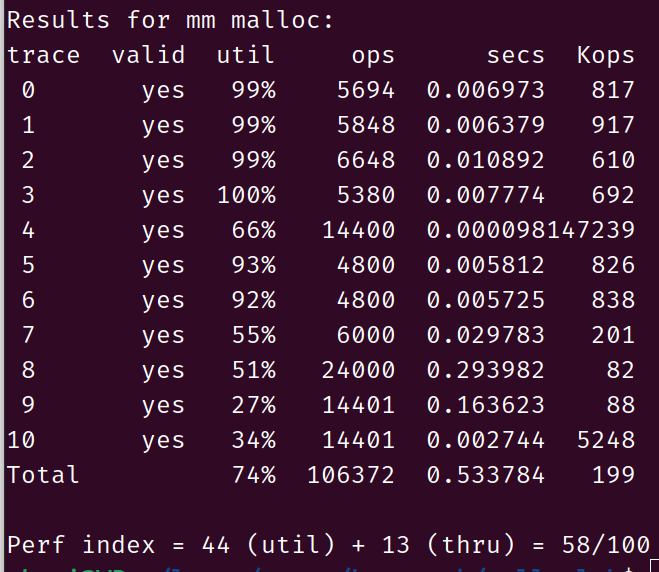

记录下学习malloclab的过程


首先查看下每一次malloc在内存中到底对应着什么东西：



我们查看上面的堆块格式可以发现，在堆块中，首先前3位代表当前的块大小是否已经被分配出去，001已分配、000没有分配。接开始的4个字节除了前3位代表的就是当前堆块的大小，之后就是我们想要的内存大小，以及最后的字节填充，还有就是脚部(脚部的作用就是为了合并空闲块简单)。

根据上面的信息解决下文件中的define，首先我们肯定较为频繁的根据指针的位置来访问块大小，以及块是否被分配出去。首先就是获取前四个字节的值，然后分别获取低3位和高29位。加上指针值代表的是应该代表的是无符号的值，还有较为频繁的就是写头部数据。

**注意：高29位的值代表的是：有多少个8个字节数目，而不是有多少字节，为什么低3位代表分没分配，因为块大小是以8字节自动对其的，低三位对于块大小来说默认是0，用来表示分没分配。**

```c
//获取指针指向的 无符号int类型 值
#define GET(p)       (*(unsigned int *)(p))  
//获取低3位的值
#define GET_ALLOC(p) (GET(p) & 0x1)
//获取32位的值，其中低3位默认是0
#define GET_SIZE(p)  (GET(p) & ~0x7)
//向指针(代表头部)写数据
#define PUT(p, val)  (*(unsigned int *)(p) = (val)) 
//将块大小和分配标记合并，结合上面的写才好
#define PACK(size, alloc)  ((size) | (alloc))
```

上面是比较基本的接下来就是根据给出的指针获取相应的头部和尾部的地址，首先我们需要知道的给出的指针是什么，根据malloc函数我们可以知道当我们需要一块内存大小的时候返回的指针地址指向的是我们存储的真实的数据，所以我们想要实现的接口返回的指针也应该是用户真实数据的地址，我们根据真实数据的地址来获取头部和尾部的地址。头部地址是真实数据地址减去4个字节，接着根据头部地址的块大小计算处尾部地址。

我们需要指针加减的时候，为了防止编译器自动乘上指针类型大小，我们需要将指针强制转换成char类型的指针在加减的时候就不会成上别的数了。

```c
//获取头部地址
#define HDRP(bp) ((char *) (bp) -WSIZE)
//获取尾部地址
#define FTRP(bp) ((char *) (bp) + GET_SIZE(HDRP(bp)) - DSIZE)
```

还有就是获取前一个、后一个block块的用户真实数据的地址(不是块的起始地址)。

```
注意：那个宏定义的括号使用，多括了，自己写的有的多括了有的少括了，感觉都是差不多的，debug特别的烦，最后还是diff和别人正确的进行比较的。一个少了个括号，一个多了个括号
```

```c
//错误的
//获取后一个block，其中GET_SIZE代表的是当前块的大小
#define NEXT_BLKP(bp) ((char *) (bp) + GET_SIZE(HDRP(bp))
//获取前一个block，其中GET_SIZE代表的是前一个块的大小
#define PREV_BLKP(bp) ((char *) (bp) - GET_SIZE(((char *) (bp) - DSIZE)))

//正确的
//获取后一个block，其中GET_SIZE代表的是当前块的大小
#define NEXT_BLKP(bp) ((char *) (bp) + GET_SIZE(HDRP(bp)))
//获取前一个block，其中GET_SIZE代表的是前一个块的大小
#define PREV_BLKP(bp) ((char *) (bp) - GET_SIZE((char *) (bp) - DSIZE))
```



接下来开始分析隐式空闲链表到底是什么东西

首先查看mm_init和mem_init的初始化函数

```c
static char *mem_heap;  /* points to first byte of heap */
static char *mem_brk;        /* points to last byte of heap */
static char *mem_max_addr;   /* largest legal heap address */

void mem_init(void) {
    /* allocate the storage we will use to model the available VM */
    if ((mem_heap = (char *) malloc(MAX_HEAP)) == NULL) {
        fprintf(stderr, "mem_init_vm: malloc error\n");
        exit(1);
    }
    mem_max_addr = mem_heap + MAX_HEAP;  /* max legal heap address */
    mem_brk = mem_heap;                  /* heap is empty initially */
}

void *mem_sbrk(int incr) {
    char *old_brk = mem_brk;

    if ((incr < 0) || ((mem_brk + incr) > mem_max_addr)) {
        errno = ENOMEM;
        fprintf(stderr, "ERROR: mem_sbrk failed. Ran out of memory...\n");
        return (void *) -1;
    }
    mem_brk += incr;
    return (void *) old_brk;
}
```

根据这个初始化函数我们可以很自然的获得mem的给我们提供的接口模型，主要就是生成一个MAX_HEAP字节的大的数组，然后将开始的地址mem_heap，开始分配的地址是mem_brk，最大的合法地址是mem_max_addr，函数mem_sbrk就是根据上面的malloc以及mem_brk位置查看是否还有内存空间。



接着就是mm初始化函数

```c
int mm_init(void) {
    /* Create the initial empty heap */
    if ((heap_listp = mem_sbrk(4 * WSIZE)) == (void *) -1) //line:vm:mm:begininit
        return -1;
    PUT(heap_listp, 0);                          /* Alignment padding */
    PUT(heap_listp + (1 * WSIZE), PACK(DSIZE, 1)); /* Prologue header */
    PUT(heap_listp + (2 * WSIZE), PACK(DSIZE, 1)); /* Prologue footer */
    PUT(heap_listp + (3 * WSIZE), PACK(0, 1));     /* Epilogue header */
    heap_listp += (2 * WSIZE);                     //line:vm:mm:endinit
    if (extend_heap(CHUNKSIZE / WSIZE) == NULL)
        return -1;
    return 0;
}

static void *extend_heap(size_t words) {
    char *bp;
    size_t size;

    size = (words % 2) ? (words + 1) * WSIZE : words * WSIZE;
    if ((long) (bp = mem_sbrk(size)) == -1)
        return NULL;
    PUT(HDRP(bp), PACK(size, 0));
    PUT(FTRP(bp), PACK(size, 0));
    PUT(HDRP(NEXT_BLKP(bp)), PACK(0, 1));
    return coalesce(bp);
}
```



在没有extend_heap执行之前模型是上面的样子，执行之后是下面的



可以发现最后一块的长度是0，当我们从头开始查找heap_listp的时候都会发现长度始终是大于0的，当查找到长度是0，并且没有有找到匹配的选项的时候这个时候我们就会使用extend_heap继续扩充mm的大小。比如说现在我们需要一个10240字节大小的内存，现在在mm模型中只有4096个字节，我们就会调用extend_heap扩容，因为在扩容的时候会发现前面一个块有可能是空闲的所以会调用coalesce块合并函数。

现在mem、mm模型算是明白了，接下来就是写一些分配算法。

目前完成了首次适应算法。之后的有时间在优化。


