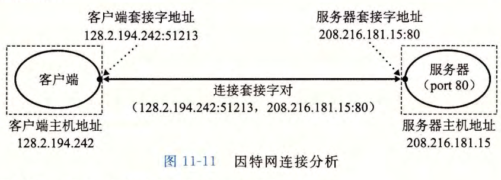
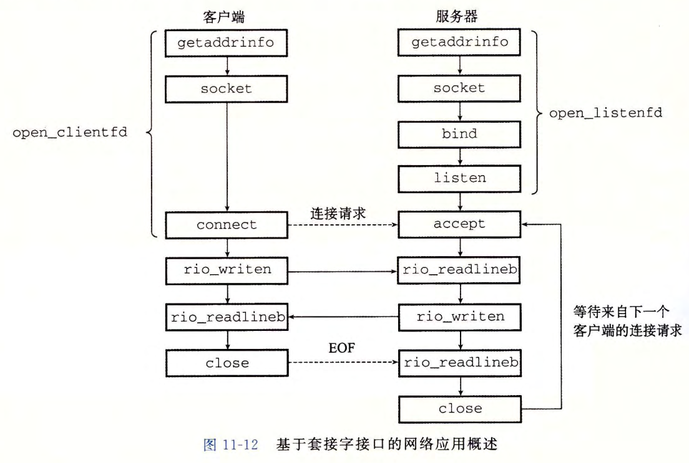
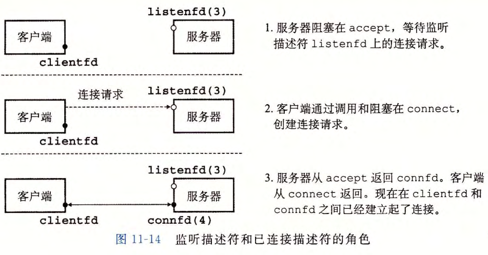

记录下proxylab的学习

一个连接是由它两端的套接字地址唯一确定的。这对套接字地址叫做套接字对 (socket
pair), 由下列元组来表示：(cliaddr: cliport, servaddr: servport)，其中 cliaddr 是客户端的 IP 地址，cliport 是客户端的端口，servaddr 是服务器的 IP地址，而 servport 是服务器的端口。

目前大概是完全抄写tiny.c，就加了一点多线程的知识，可能是测试用例比较松，前两个部分也都算是完成了但是还是有很多方面不是很清楚，在请求上面网络到底遵从什么协议，比如说我从一个浏览器上面直接输出  localhost:8080......，对应的本地服务器的端口号8080到底接收到的是什么字符串，遵从的是什么协议，还有就是相应的网络命令作者提供的三种debug的方法，遵从的是什么协议，相应的动态请求还有静态请求等等。最后多线程的知识也有点忘记了。目前时间比较少，等之后完成了一些东西回来再完成这个实验