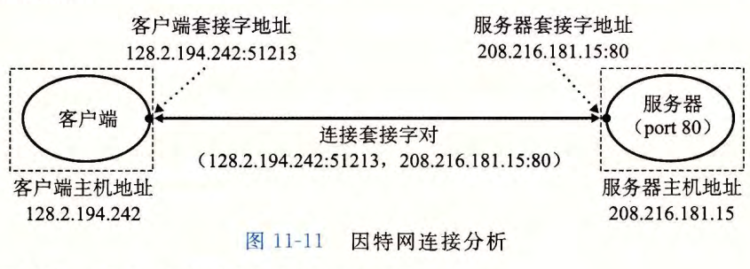
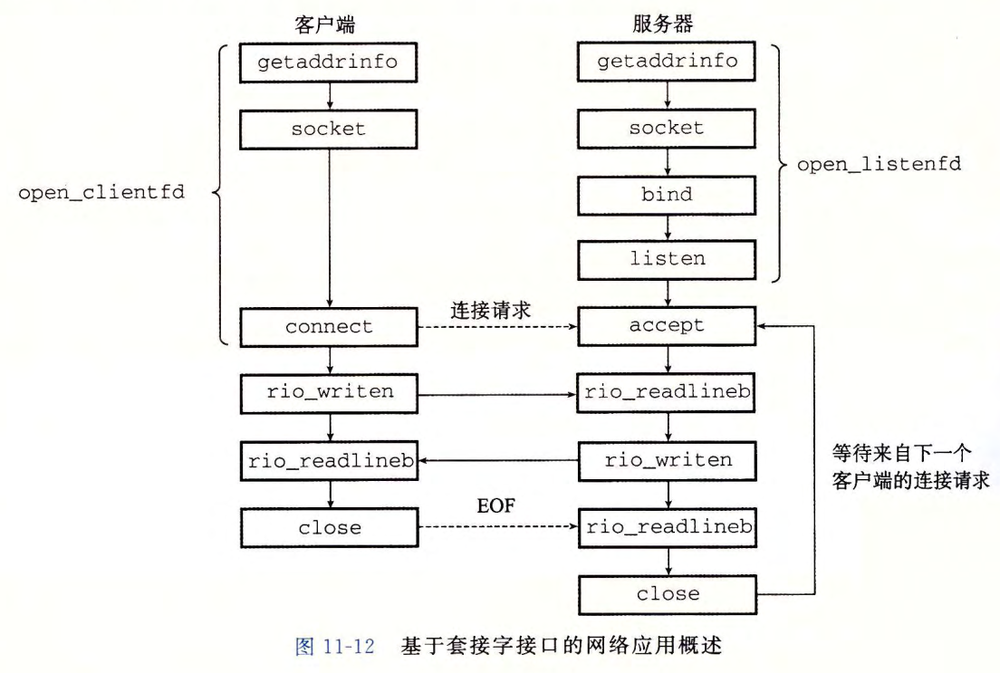
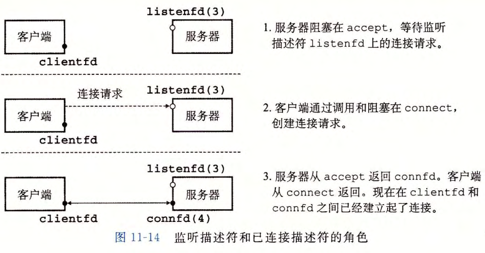

记录下proxylab的学习

一个连接是由它两端的套接字地址唯一确定的。这对套接字地址叫做套接字对 (socket
pair), 由下列元组来表示：(cliaddr: cliport, servaddr: servport)，其中 cliaddr 是客户端的 IP 地址，cliport 是客户端的端口，servaddr 是服务器的 IP地址，而 servport 是服务器的端口。







在写代理之前需要想明白代理的任务是什么：首先代理是需要不断的检查本地的请求，并且读取本地的请求服务器的信息。使用命令telnet如下

```shell
shuai@WP:~$ telnet localhost 9090
Trying 127.0.0.1...
Connected to localhost.
Escape character is '^]'.
GET http://localhost:8080/home.html HTTP/1.0
HTTP/1.0 200 OK
Server: Tiny Web Server
Content-length: 120
Content-type: text/html

<html>
<head><title>test</title></head>
<body> 

Dave O'Hallaron
</body>
</html>
Connection closed by foreign host.
```

我在本地开启代理端口是9090，服务器端口是8080，先是连接9090端口请求服务器资源/home.html这个时候代理会先查找本地的cache中查看，当前是否有url = http://localhost:8080/home.html的content如果有那么直接返回给客户端，如果没有代理服务器9090会向服务器8080请求资源home.html，将服务器给代理的content在本地保存下来并且也返回给客户端，当客户端下次访问的时候直接就会在cache找到相关的内容直接返回，不会再请求服务器8080。

telnet命令是为了连接服务器端口号，接下来的输入的内容是服务器接收端read的，然后根据read的数据进行相应的逻辑的处理，注意该服务器并不是服务器8080,相对于客户端代理9090也可以算是服务器。

对于cache的实现，我是使用LRU算法，实现是使用双链表进行的结构体是

```c
typedef struct node
{
    char url[MAXLINE];
    char content[MAX_OBJ];
    struct node *pre;
    struct node *next;
    size_t content_len;
    /* data */
}node;

typedef struct Cache
{
    size_t size;          //最大cache为100
    sem_t mutex;          //互斥访问cache
    struct node *head;    //常访问的放到头节点
    struct node *tail;
    /* data */
}Cache;
```

具体的相关内容可以查看代码。


其中测试的部分仅仅是：

```
shuai@WP:~$ telnet localhost 9090

GET http://localhost:8080/home.html HTTP/1.0
GET http://localhost:8080/csapp.c HTTP/1.0
GET http://localhost:8080/tiny.c HTTP/1.0
```

