首先应该明白每一个函数应该有什么操作，接着思考信号的处理情况，每一个信号处理函数到底是什么作用，应该在什么情况下使用。

首先搭建起最基本的框架：(写出每个函数的大致作用)

eval函数

```c
void eval(char *cmdline) {
    char *argv[MAXARGS];
    int bg;
    char buf[MAXLINE];
    pid_t pid;
    strcpy(buf, cmdline);
    bg = parseline(buf, argv);
    if (argv[0] == NULL) {
        return;
    }
    if (!builtin_cmd(argv)) {      
        if ((pid = fork()) == 0) {
            if (execve(argv[0], argv, environ) < 0) {
                unix_error("execve error.\n");
                exit(0);
            }
        } 
        if (!addjob(jobs, pid, bg ? BG : FG, cmdline)) {
            app_error("create job failed");
        }
        if (!bg) {
            waitfg(pid);
        } else {
            printf("[%d] (%d) %s", pid2jid(pid), pid, cmdline);
        }
    }
    return;
}
```

```c
int builtin_cmd(char **argv) {
    if (!strcmp(argv[0], "quit")) {
        exit(0);
    }
    //列出正在运行的以及结束运行的进程
    if (!strcmp(argv[0], "jobs")) {
        listjobs(jobs);
        return 1;
    }
    if (!strcmp(argv[0], "bg") || !strcmp(argv[0], "fg")) {
        do_bgfg(argv);
        return 1;
    }
    //终止一个进程
    if (!strcmp(argv[0], "kill")) {
        mykill();
        return 1;
    }
    return 0;     /* not a builtin command */
}
```

```c
//如果当前的前端进程没有执行完毕就等待，不断的查找当前pid的状态
//处在当前的情境下bugger
//但是可以使用该程序检测某个进程的状态
void waitfg(pid_t pid) {
    int status;
    while (1){
        pid_t return_pid = waitpid(pid, &status, WNOHANG);
        if (return_pid == -1) {
            /* error */
        } else if (return_pid == 0) {
            /* child is still running */
        } else if (return_pid == pid) {
            break;
            /* child is finished. exit status in   status */
        }
    }
    return;
}
```

首先先构建没有阻塞、没有信号处理，并且相关的do_bgfg()函数(仅仅是一个输出标记)也没有实现的大体的情况。

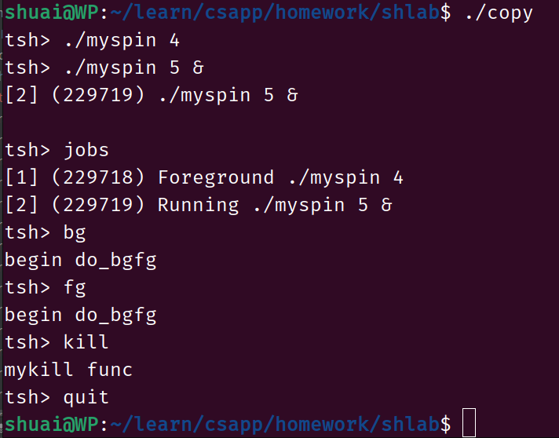

可以查看到大致的代码流程

分析上面的代码，对于结束的进程我们需要将jobs中的进程进行删除(例如./myspin 4，执行完毕在jobs中需要删除)，那么我们需要捕捉子进程结束向父进程发送的SIGCHLD信号。在捕捉的时候也分为前端进程还是后端进程，这两个在进程结束的时候的SIGCHLD信号都必须要捕捉到。

在捕捉子进程信号我们参考的代码是书本上的waitpid函数

```c
void sigchld_handler(int sig) {
    int olderrno = errno;
    pid_t pid;
    int status;
    while ((pid = waitpid(-1, &status, 0)) > 0) {
        if (WIFEXITED(status)) {     //exit or return
            printf("child exit\n");
            deletejob(jobs, pid);
        }
    }
    errno = olderrno;
    return;
}
```


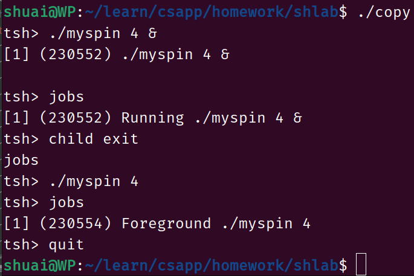

根据上面的执行结果可以发现我们可以对后端的进程在结束的时候，进行删除jobs结构体数组操作，但是对于前端的`./myspin 4`可以看出来并没有输出child exit，并且在前端结束的之后也没有删除jobs里面的数据。


接下来的情况就是使得父进程能够收到来自前端子进程结束的时候发出的信号SIGCHLD。


查看8.5.7小节我们可以看到（有时候主程序需要显式地等待某个信号处理程序运行 。 例如，当 Linux shell 创建一个前台作业时，在接收下一条用户命令之前，它必须等待作业终止，被SIGCHLD处理程序回收。）可以发现这一句话正好可以对应我们的想法，我们这个时候需要处理前台作业，等待前台作业终止，然后该子进程被SIGCHLD处理程序回收。


经过了一系列的思考我才明白，为什么当前的父进程没有接受到相关的子进程发出的信号SIGCHLD，然后执行sigchld_handler函数处理。我的发现是waitpid函数，在进行waitfg的时候已经对当前的进程进行了信息清除，当子进程执行完毕执行的是waitfg函数中的waitpid而不是sigchld_handler里面的waitpid，这个时候我们需要进行修改相应的函数。

```c
//查找当前jobs是否还有前端进程，如果有的话那么就阻塞等待
//直到sigchld_handler里面的执行deletejob然后就会修改fgpid(jobs)的返回值，跳出循环
void waitfg(pid_t pid) {
    while (fgpid(jobs) > 0) {
    }
    return;
}
```

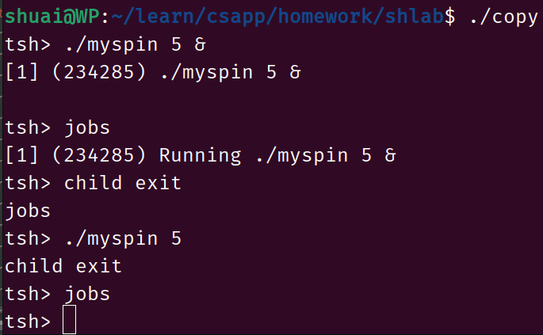

这个时候我们会发现，对于前台作业以及后台作业，正常退出的情况下，都会执行sigchld_handler信号处理程序进行处理。并且上面的执行过程也是正确的。


结下来思考的就是对信号<C - c>以及<C - z>信号的处理。

开始编写<C - c>

```c
void sigchld_handler(int sig) {
    int olderrno = errno;
    pid_t pid;
    int status;
    while ((pid = waitpid(-1, &status, 0)) > 0) {
        if (WIFEXITED(status)) {     //exit or return
            printf("child exit\n");
            deletejob(jobs, pid);
        }else if (WIFSIGNALED(status)) {   //terminated by signal
            printf("Job [%d] (%d) terminated by signal %d\n", pid2jid(pid), pid, WTERMSIG(status));
            deletejob(jobs, pid);
        }
    }
    errno = olderrno;
    return;
}
```

为了区分子程序是正常exit，或者是有<C - c>信号结束的，在sigchld_handler处理程序上应该进行区分，然后就是sigint_handler处理程序。

该处理程序的思想就是获取前台作业的pid，

```c
//<C-c>给前台进程的所有的进程组
void sigint_handler(int sig) {
//    printf("catch <C - c>\n");
    int olderrno = errno;
    //获取当前前端进程的进程组id
    pid_t pid = fgpid(jobs);
    if (pid == 0) {     //代表当前没有前台作业，那么直接返回
        errno = olderrno;
        return;
    }
    //发送终止信号对改进成的所有的同一进程组的进程
    kill(-pid, SIGINT);
    errno = olderrno;
    return;
}
```

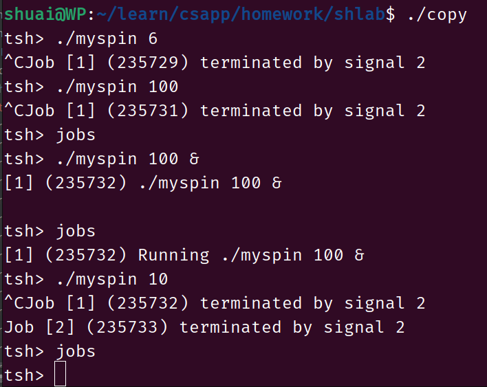

这个时候我们发现对于前台作业我们能够使用<C - c>进行终结任务，但是我们发现了一个很严重的问题就是，他会终结我们不希望终结的一些后台作业，比如说  `./myspin 100 &`。

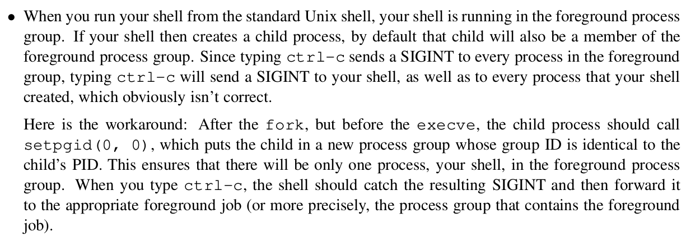

参考pdf的提示我们可以发现上面的问题，怎么解决。

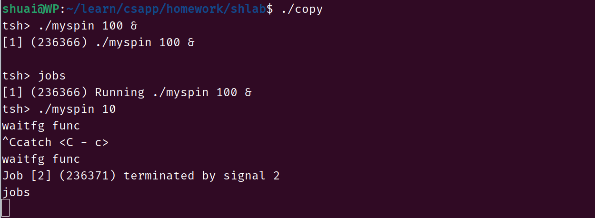

经过了在fork和execv之间添加setpgid(0,0)，我们可以发现确实只删除了一个进程，但是还有一个很懵逼的事情，妹的命令行提示tsh>没有了

查看hints提示的第三个有  waitpid提示  ：WUNTRACED | WNOHANG

```c
void sigchld_handler(int sig) {
    int olderrno = errno;
    pid_t pid;
    int status;
    while ((pid = waitpid(-1, &status, WUNTRACED | WNOHANG)) > 0) {
        if (WIFEXITED(status)) {     //exit or return
            printf("child exit\n");
            deletejob(jobs, pid);
        }else if (WIFSIGNALED(status)) {   //terminated by signal
            printf("Job [%d] (%d) terminated by signal %d\n", pid2jid(pid), pid, WTERMSIG(status));
            deletejob(jobs, pid);
        }
    }
    errno = olderrno;
    return;
}
```

我们修改了 waitpid 里面的0 为WUNTRACED | WNOHANG。第三个参数为 0 的含义是，当还有子进程存在时，就挂起父进程，直到子进程终止（停止）。如果这个 shell 没有运行后台进程的话，那么其实还好；但是一旦有一个前台进程和一个后台进程同时运行的话，呵呵，那就不好意思了——当前台进程终止（停止），shell 就会开始执行上面那个 while 循环，处理前台进程；处理完之后呢，因为后台进程还在执行呀，所以 shell 会被 waitpid 卡住，直到后台进程结束，才会继续向下执行。而改成 WUNTRACED | WNOHANG 就不会出现这个问题了——此时的 waitpid，只是去看一眼有没有已经终止（停止）的后台进程，而不会等待进程执行完才返回。


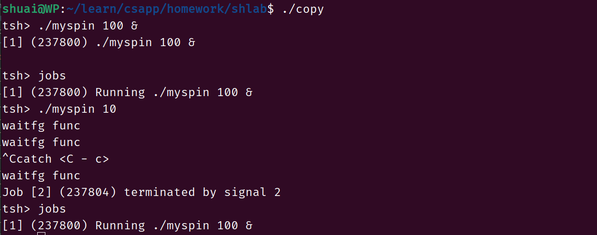


接下来就是处理<C - z>信号和<C - c>类似。

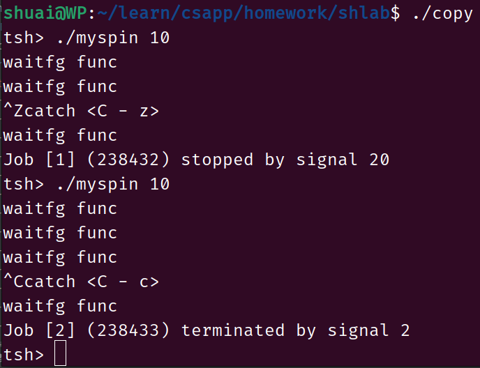

除了没有设置信号阻塞，其余的都完毕了，当前的信号处理函数是：

```c
void sigchld_handler(int sig) {
    int olderrno = errno;
    pid_t pid;
    int status;
    while ((pid = waitpid(-1, &status, WUNTRACED | WNOHANG)) > 0) {
        if (WIFEXITED(status)) {     //exit or return
            printf("child exit\n");
            deletejob(jobs, pid);
        }else if (WIFSIGNALED(status)) {   //terminated by signal
            printf("Job [%d] (%d) terminated by signal %d\n", pid2jid(pid), pid, WTERMSIG(status));
            deletejob(jobs, pid);
        } else if (WIFSTOPPED(status)){
            printf("Job [%d] (%d) stopped by signal %d\n",pid2jid(pid), pid, WSTOPSIG(status));
            struct job_t* job = getjobpid(jobs, pid);
            job->state = ST;
        }
    }
    errno = olderrno;
    return;
}

void sigint_handler(int sig) {
    printf("catch <C - c>\n");
    int olderrno = errno;
    //获取当前前端进程的进程组id
    pid_t pid = fgpid(jobs);
    if (pid == 0) {     //代表当前没有前台作业，那么直接返回
        errno = olderrno;
        return;
    }
    //发送终止信号对改进成的所有的同一进程组的进程
    kill(-pid, SIGINT);
    errno = olderrno;
    return;
}

void sigtstp_handler(int sig) {
    printf("catch <C - z>\n");
    int olderrno = errno;
    //获取当前前端进程的进程组id
    pid_t pid = fgpid(jobs);
    if (pid == 0) {     //代表当前没有前台作业，那么直接返回
        errno = olderrno;
        return;
    }
    //发送终止信号对改进成的所有的同一进程组的进程
    kill(-pid, SIGTSTP);
    errno = olderrno;
    return;
}

```


接下来的操作就是进行任务的处理

```c
void do_bgfg(char **argv) {
    printf("begin do_bgfg\n");
    int jid, pid;
    struct job_t *cur_job;
    //首先判断当前的第二个参数到底是一个jid还是pid
    if (argv[1][0] == '%') {     //get jid
        jid = atoi(argv[1] + 1);
        cur_job = getjobjid(jobs, jid);
        if (cur_job == NULL) {
            printf("%d: No such job.\n", jid);
            return;
        }
        //获取当前的进程的进程组
        pid = cur_job->pid;
    } else {                    //get pid
        pid = atoi(argv[1]);
        cur_job = getjobpid(jobs, pid);
        if (cur_job == NULL) {
            printf("%d: No such job.\n", jid);
            return;
        }
    }
    if (!strcmp(argv[0], "fg")) {     //bg将一个停止运行在后端的进程，重新运行在前端
        cur_job->state = FG;
        kill(-pid, SIGCONT);
        waitfg(pid);
    } else {                          //fg将一个停止或者正在运行的后端进程放到后端运行
        cur_job->state = BG;
        kill(-pid, SIGCONT);  //将一个stopped的进程继续开始执行
        printf("[%d] (%d) %s", cur_job->jid, pid, cur_job->cmdline);
    }
    return;
}void do_bgfg(char **argv) {
    printf("begin do_bgfg\n");
    int jid, pid;
    struct job_t *cur_job;
    //首先判断当前的第二个参数到底是一个jid还是pid
    if (argv[1][0] == '%') {     //get jid
        jid = atoi(argv[1] + 1);
        cur_job = getjobjid(jobs, jid);
        if (cur_job == NULL) {
            printf("%d: No such job.\n", jid);
            return;
        }
        //获取当前的进程的进程组
        pid = cur_job->pid;
    } else {                    //get pid
        pid = atoi(argv[1]);
        cur_job = getjobpid(jobs, pid);
        if (cur_job == NULL) {
            printf("%d: No such job.\n", jid);
            return;
        }
    }
    if (!strcmp(argv[0], "fg")) {     //bg将一个停止运行在后端的进程，重新运行在前端
        cur_job->state = FG;
        kill(-pid, SIGCONT);
        waitfg(pid);
    } else {                          //fg将一个停止或者正在运行的后端进程放到后端运行
        cur_job->state = BG;
        kill(-pid, SIGCONT);  //将一个stopped的进程继续开始执行
        printf("[%d] (%d) %s", cur_job->jid, pid, cur_job->cmdline);
    }
    return;
}
```

这是比较重要的操作了，主要就是获取pid或者gid，然后根据bg和fg进行分别的信号发送操作。

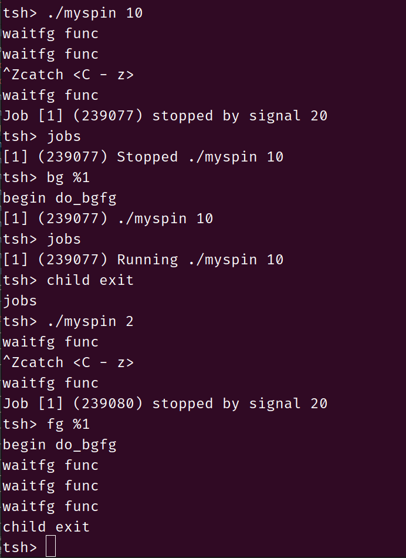

上面是对于一个前台作业先是暂停，然后在后台运行(查看进程的状态)，还有一个是前台作业暂停，接着在前台执行。


到目前为止可以说大部分都写完毕了，现在就要开始进行信号的阻塞操作。对于这方面其实无论是代码方面还是理论上都还是有点懵的。

**接下来说说自己对与信号理论上的理解，首先什么时候执行信号处理：先说每个进程都会占据cpu的一部分时间，然后不断的在cpu上进行切换，每当一个程序上cpu这个时候就会检查下当前的进程是否接收到某些信号，然后执行信号处理函数，如果没有接收到信号那么继续下面的执行。现在我们讨论的是接收的信号之后是什么情况。**

隐式阻塞：

- 当我接受到信号s，正在执行s处理程序，这个时候来了信号t，会执行t的信号处理程序(如下图所示)

  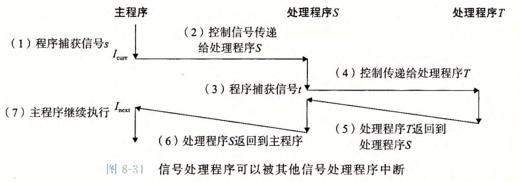

- 但是如果第二个来的信号还是s，那么这个时候程序会阻塞s信号，不会递归的执行信号s，设置第二个信号s为待处理。如果在处理第一个信号s，接连来了两个信号s，那么第二个信号s为待处理，第三个信号s会被丢弃。

显式阻塞：

应用程序可以使用 sigprocmask 函数和它的辅助函数，明确地阻塞和解除阻塞选定的信号(主要的手段是当我执行某个信号处理函数的时候，我们想阻塞其余的信号，不想让其余的信号继续中断当前的信号处理函数，然后阻塞，之后写一段代码，该段代码的执行不会被信号处理函数所影响，然后就需要解除相关的阻塞信号操作)。


然后看看阻塞信号都有哪些函数？

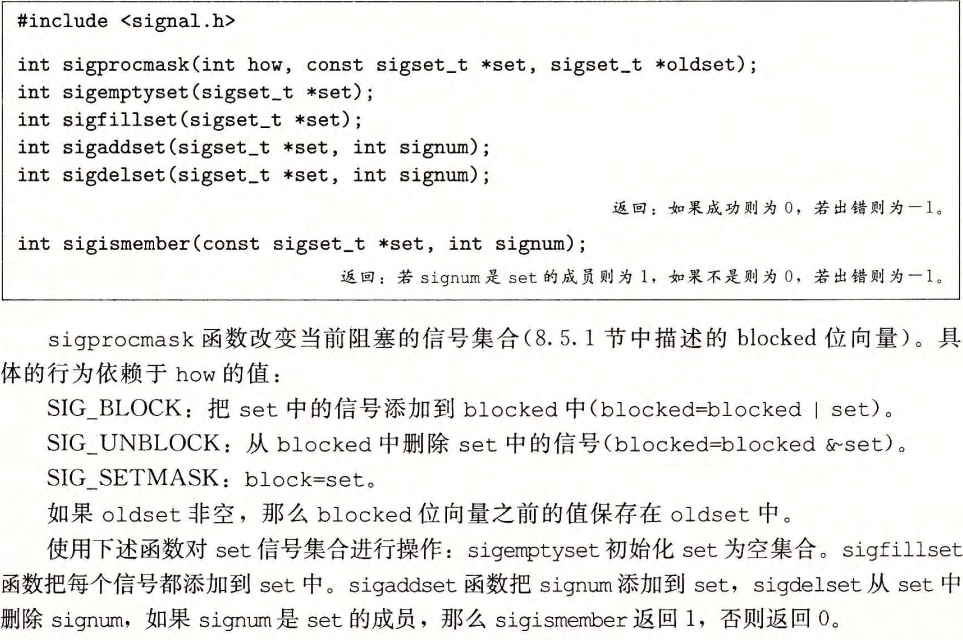

```c
//阻塞某个信号SIGINT
sigset_t mask, prev_mask;

sigemptyset(&mask);
sigaddset(&mask, SIGINT);
sigprocmask(SIG_BLOCK, &mask, &prev_mask);
/*   do something code */
sigprocmask(SIG_SETMASK, &prev_mask, NULL);

    //阻塞所有的信号
    sigset_t mask, prev_mask;

    sigemptyset(&mask);
    sigfillset(&mask);
    sigprocmask(SIG_BLOCK, &mask, &prev_mask);
/*   do something code */
    sigprocmask(SIG_SETMASK, &prev_mask, NULL);
```

首先我们创建两个信号set变量mask ，prev_mask。然后sigemptyset函数初始化set集合代表当前的set集合什么信号都不阻塞，然后向mask信号中添加SIGINT信号，执行sigprocmask函数，prev_mask代表什么意思，我查找了man 2 大致的意思是sigprocmask(SIG_BLOCK, &mask, &prev_mask);会将mask 的信号添加到block中，并且将之前的block赋值给prev_mask，那么sigprocmask(SIG_SETMASK, &prev_mask, NULL);函数就很好理解了，将之前的block重新复制给当前的block，解除阻塞信号。

了解了阻塞信号函数，接下来就是什么时候使用阻塞函数。

- 阻塞所有的信号，保护对共享全局数据结构的访问(读或者写的时候阻塞所有的信号)。
- 根据hint可以知道，在创建进程之前需要阻塞SIGCHLD信号，创建完毕后解除阻塞。

接下来就是最后一次修改上面的函数操作。(哈哈哈终于快要完成了)


```c
void eval(char *cmdline) {
    char *argv[MAXARGS];
    int bg;
    char buf[MAXLINE];
    pid_t pid;
    strcpy(buf, cmdline);
    bg = parseline(buf, argv);
    if (argv[0] == NULL) {
        return;
    }
    if (!builtin_cmd(argv)) {
        //阻塞某个信号SIGINT
        sigset_t mask, prev_mask;
        sigemptyset(&mask);
        sigaddset(&mask, SIGCHLD);
        sigprocmask(SIG_BLOCK, &mask, &prev_mask);
        if ((pid = fork()) == 0) {
            //解除阻塞的子进程
            sigprocmask(SIG_SETMASK, &prev_mask, NULL);
            setpgid(0, 0);       //防止在<C - c>的时候删除多个后台作业
            if (execve(argv[0], argv, environ) < 0) {
                printf("%s: Command not found\n",argv[0]);
                exit(0);
            }
        }
        if (!addjob(jobs, pid, bg ? BG : FG, cmdline)) {
            app_error("create job failed");
        }
        //解除阻塞的父进程
        sigprocmask(SIG_SETMASK, &prev_mask, NULL);
        if (!bg) {
            waitfg(pid);
        } else {
            printf("[%d] (%d) %s", pid2jid(pid), pid, cmdline);
        }
    }
    return;
}
```


```c
int builtin_cmd(char **argv) {
    if (!strcmp(argv[0], "quit")) {
        exit(0);
    }
    //列出正在运行的以及结束运行的进程
    if (!strcmp(argv[0], "jobs")) {
        //阻塞所有的信号
        sigset_t mask, prev_mask;
        sigemptyset(&mask);
        sigfillset(&mask);
        sigprocmask(SIG_BLOCK, &mask, &prev_mask);
        listjobs(jobs);
        sigprocmask(SIG_SETMASK, &prev_mask, NULL);
        return 1;
    }
    if (!strcmp(argv[0], "bg") || !strcmp(argv[0], "fg")) {
        do_bgfg(argv);
        return 1;
    }
    //终止一个进程
    if (!strcmp(argv[0], "kill")) {
        return 1;
    }
    return 0;     /* not a builtin command */
}
```

```c
void do_bgfg(char **argv) {
//    printf("begin do_bgfg\n");
    int jid = 0, pid = 0;
    struct job_t *cur_job;
    //首先判断当前的第二个参数到底是一个jid还是pid
    if (argv[1] == NULL) {
        printf("%s command requires PID or %%jobid argument\n", argv[0]);
        return;
    }

    if (argv[1][0] == '%') {     //get jid
        jid = atoi(argv[1] + 1);
    } else {                    //get pid
        pid = atoi(argv[1]);
    }
    // 乱填 jid 或是 pid 的情况之一
    if ((jid == 0 && argv[1][0] == '%') || (pid == 0 && argv[1][0] != '%')) {
        printf("%s: argument must be a PID or %%jobid\n", argv[0]);
        return;
    }
    //阻塞所有的信号
    sigset_t mask, prev_mask;
    sigfillset(&mask);
    sigprocmask(SIG_BLOCK, &mask, &prev_mask);
    if (jid == 0) {    //说明当前是组
        jid = pid2jid(pid);
    }
    cur_job = getjobjid(jobs, jid);

    if (cur_job == NULL) {
        if (argv[1][0] != '%'){
            printf("(%s): ", argv[1]);
        }else{
            printf("%s: ", argv[1]);
        }
        printf("No such %s\n", argv[1][0] == '%' ? "job" : "process");
        sigprocmask(SIG_SETMASK, &prev_mask, NULL);
        return;
    }
    if (!strcmp(argv[0], "fg")) {     //bg将一个停止运行在后端的进程，重新运行在前端
        cur_job->state = FG;
        kill(-pid, SIGCONT);
        //注意此时的解除阻塞在waitfg前面
        sigprocmask(SIG_SETMASK, &prev_mask, NULL);
        waitfg(pid);
    } else {                          //fg将一个停止或者正在运行的后端进程放到后端运行
        cur_job->state = BG;
        kill(-pid, SIGCONT);  //将一个stopped的进程继续开始执行
        printf("[%d] (%d) %s", cur_job->jid, pid, cur_job->cmdline);
        sigprocmask(SIG_SETMASK, &prev_mask, NULL);
    }

    return;
}
```

```c
void waitfg(pid_t pid) {
    //阻塞所有的信号
    sigset_t mask, prev_mask;
    sigemptyset(&mask);
    sigfillset(&mask);
    while (1) {
        sigprocmask(SIG_BLOCK, &mask, &prev_mask);
        pid_t fg_pid = fgpid(jobs);
        sigprocmask(SIG_SETMASK, &prev_mask, NULL);
        sleep(1);
        if (fg_pid > 0){
            break;
        }
    }
    return;
}
```

```c
void sigchld_handler(int sig) {
    int olderrno = errno;
    pid_t pid;
    int status;
    sigset_t mask, prev_mask;
    sigemptyset(&mask);
    sigfillset(&mask);
    sigprocmask(SIG_BLOCK, &mask, &prev_mask);
    while ((pid = waitpid(-1, &status, WUNTRACED | WNOHANG)) > 0) {
        if (WIFEXITED(status)) {     //exit or return
//            printf("child exit\n");
            deletejob(jobs, pid);
        } else if (WIFSIGNALED(status)) {   //terminated by signal
            printf("Job [%d] (%d) terminated by signal %d\n", pid2jid(pid), pid, WTERMSIG(status));
            deletejob(jobs, pid);
        } else if (WIFSTOPPED(status)) {
            printf("Job [%d] (%d) stopped by signal %d\n", pid2jid(pid), pid, WSTOPSIG(status));
            struct job_t *job = getjobpid(jobs, pid);
            job->state = ST;
        }
    }
    sigprocmask(SIG_SETMASK, &prev_mask, NULL);
    errno = olderrno;
    return;
}
```

```c
void sigint_handler(int sig) {
//    printf("catch <C - c>\n");
    int olderrno = errno;
    //获取当前前端进程的进程组id
    sigset_t mask, prev_mask;
    sigemptyset(&mask);
    sigfillset(&mask);
    sigprocmask(SIG_BLOCK, &mask, &prev_mask);
    pid_t pid = fgpid(jobs);
    sigprocmask(SIG_SETMASK, &prev_mask, NULL);
    if (pid == 0) {     //代表当前没有前台作业，那么直接返回
        errno = olderrno;
        return;
    }
    //发送终止信号对改进成的所有的同一进程组的进程
    kill(-pid, SIGINT);
    errno = olderrno;
    return;
}
```

```c
void sigtstp_handler(int sig) {
//    printf("catch <C - z>\n");
    int olderrno = errno;
    //获取当前前端进程的进程组id
    sigset_t mask, prev_mask;
    sigemptyset(&mask);
    sigfillset(&mask);
    sigprocmask(SIG_BLOCK, &mask, &prev_mask);
    pid_t pid = fgpid(jobs);
    sigprocmask(SIG_SETMASK, &prev_mask, NULL);
    if (pid == 0) {     //代表当前没有前台作业，那么直接返回
        errno = olderrno;
        return;
    }
    //发送终止信号对改进成的所有的同一进程组的进程
    kill(-pid, SIGTSTP);
    errno = olderrno;
    return;
}
```

完毕！！！！！！

使用make testXX  和make rtestXX对比发现。